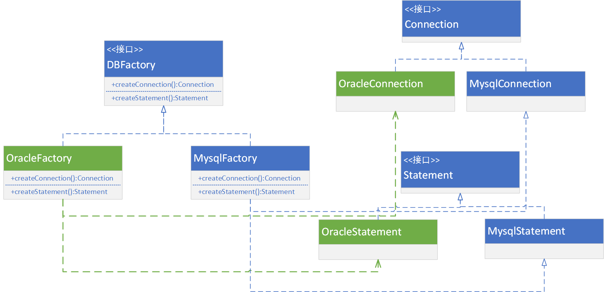

[toc]

# 抽象工厂模式

抽象工厂模式是常见的创建型设计模式之一。比工厂方法模式的抽象级别更高。

> + 在工厂方法模式中，每个工厂只需要生产一种具体的产品；
> + 在抽象工厂模式中，具体工厂可以生产相关的一组具体产品，这样的一组产品称之为产品族，产品族中的每一个产品都分属于某一个产品继承等级结构。

**简单来说，就是抽象工厂可以使得每一个具体的工厂类可以产生多个具体产品。**在实际的软件开发中，抽象工厂模式的使用频率很高。

# 定义

提供一个创建一系列相关或互相依赖对象的接口，而无须指定他们具体的类。

# 抽象工厂的结构

1. **抽象工厂：**用于声明生成抽象产品的方法，在一个抽象工厂中可以定义一组方法，每一个方法对应一个产品等级结构。
2. **具体工厂：**实现了抽象工厂声明的生成抽象产品的方法，生成一组具体产品，这些产品构成了一个产品族，每个产品都位于某个产品等级结构中。
3. **抽象产品：**抽象产品为每种产品声明接口，在抽象产品中定义了产品的抽象业务方法。
4. **具体产品：**定义具体工厂产生的具体产品对象，实现抽象产品接口中定义的业务方法。

# 抽象工厂模式-案例 1

使用Java 实现如下场景：

某系统为了改进数据库操作的性能，自定义数据库连接对象`Connection`和语句对象 `Statement`，可针对不同类型的数据库提供不同的连接对象和语句对象，如提供`Oracle`或`MySQL`专用连接类和语句类，而且用户可以通过配置文件等方式根据实际需要动态切换系统数据库。

> 因为这个抽象工厂的类太多了（核心原因还是本人太懒了），本次的案例就这一个吧。

# 抽象工厂模式总结

## 优点

1. 抽象工厂模式隔离了具体类的生成，使得客户并不需要知道什么被创建。由于这种隔离，要更换一个具体的工厂就变得相对容易。应用抽象工厂模式可以**实现高内聚低耦合**的设计目的。
2. 当一个产品族中的多个对象被设计成一起工作时，它能够保证客户端始终只适用同一个产品族中的对象。这对一些需要根据当前环境来决定其行为的软件系统来说，是一种非常适用的设计模式。
3. 增加新的具体的工厂和产品族很方便，无需修改已有系统，符合**开闭原则**。

## 缺点

在添加新的产品对象时，难以扩展工厂生产新种类的产品，这是因为在抽象工厂角色中规定了所有可能被创建的产品集合，要支持新种类的产品就意味着要对该接口进行扩展，而这将涉及对抽象工厂角色及其所有子类的修改，显然会带来较大的麻烦。

> 当然，这在 Java 来说，已经不是问题了。不知道各位有听过接口中的默认方法没有？
>
> 我的想法是，在顶层的抽象工厂中，支持新种类的产品时，在接口中就定义一个对应的默认方法，然后抛出一个不支持的操作异常即可。
>
> 这么以来，想要扩展哪个部分就可以专门去实现哪个部分了。

## 模式适用环境

1. 一个系统不应该依赖于产品实例如何被创建、组合和表达的细节，这对于所有类型的工厂模式都是重要的。用户无需关心对象的创建过程，将对象的创建和使用解耦。
2. 系统中有多于一个的产品族，而每次只使用其中某一产品族。可以通过配置文件等方式来使得用户可以动态改变产品族，也可以很方便地增加新的产品族。
3. 属于同一个产品族的产品将在一起使用，这一约束必须在系统的设1计中体现出来。同一个产品族的产品是可以没有任何关系的对象，但是它们都具有一些共同的约束。如同操作系统的按钮和文本框，没有直接关系，但是属于某一操作系统，windows或Linux。它们的约束类型是：操作系统的类型。
4. 系统提供一个产品类的库，所有的产品以同样的接口出现，从而使客户端不依赖于具体实现。对于这些产品，用户只需要知道它们提供了哪些具体的业务方法，而不需要知道这些对象的创建过程，在客户端代码中针对抽象编程，而将具体类写入配置中。

## 模式扩展

1. 开闭原则：当抽象工厂中需要增加产品族时，直接增加一个具体的工厂类和相关的产品类。
2. 开闭原则的倾斜：增加产品等级结构时，就得大改了。体现出来就是，所有的工厂类都需要增加生产新的产品的方法。

## 模式的退化

当抽象工厂模式中每一个具体工厂类只创建一个产品对象，也就是只存在一个产品等级结构时，**抽象工厂模式退化成工厂方法模式**；

当工厂方法模式中的抽象工厂与具体工厂合并，提供一个统一的工厂来创建产品对象，并将创建对象的工厂方法设计为静态方法时，**工厂方法模式退化成简单工厂模式**。