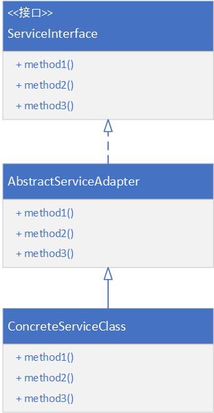

[toc]

# 适配器模式

## 前言

适配器模式是一种使用频率非常高的结构型设计模式。

> 结构型设计模式：根据类的“单一职责原则”，一个软件系统中每一类都应该担负一定的职责，能够完成一定的业务功能，但单个类的作用是有限的，系统中很多任务的完成需要多个类相互协作，因此需要将这些类或者类的实例进行组合。

## 结构型设计模式

结构型模式描述如何将类或者对象结合在一起形成更大的结构。结构型模式可以描述两种不同的东西：类与类的实例（即对象）。根据这一点，结构型模式可以分为类结构型模式和对象结构型模式。**类结构型模式**关心类的组合，由多个类可以组合成一个更大的系统，在类结构型模式中一般只存在继承关系和实现关系；而**对象结构型模式**关心类与对象的组合，通过关联关系使得在一个类中定义另一个类的实例对象，然后通过该对象调用其方法，**根据“合成复用原则”，在系统中应当尽量使用关联关系来代替继承关系，因此大部分结构型模式都是对象结构型模式**。

# 适配器的定义

> 在现实生活中，经常存在一些不兼容。如某电器的工作电压与家庭交流电电压不一致，网络速度与计算机处理速度不一致、某硬件设备提供的接口与计算机支持的接口不一致等。
>
> 这种情况下，我们可以通过一个新的设备使原本不兼容的事物可以一起工作，这个新的设备称为适配器。软件中为了解决这种问题就引入了适配器的概念。

将一个接口转换成客户希望的另一个接口，适配器模式使接口不兼容的那些类可以一起工作，其别名为包装器（Wapper）。适配器模式既可以作为类结构型模式。

# 适配器模式的结构

1. Target 目标抽象类：目标抽像类定义客户要用的特定领域的接口，可以是个抽象类或接口，也可以是具体类；在类适配器中，由于Java语句不支持多重继承，它只能是接口。（在Java 8 中，可以用默认方法去设计一个适配器）
2. Adapter 适配器类：适配器类可以调用另一个接口，作为一个转换器，对Adapter 和 Target 进行适配。适配器类是适配器模式的核心，它通过实现 Target 接口并继承 Adaptee 类来使二者产生联系，在对象适配器中，它通过继承 Target 并关联一个 Adaptee 的对象使二者产生联系。
3. Adaptee 适配者类：适配者即被适配的角色，它定义了一个已经存在的接口，这个接口需要适配，适配者类一般是一个具体的类，包含了客户希望使用的业务方法，在某些情况下甚至没有适配者的源代码。
4. Client 客户类：在客户类中针对目标抽象类进行编程，调用在目标抽象类中定义的业务方法。

# 适配器模式-类适配器案例

> Java 代码实现见：`org.feng.pattern.adapter1` 包。

# 适配器模式-对象适配器案例

其差别在于，Adapter 并不需要继承 `Adaptee` 了，只需要使用构造器注入 `Adaptee` 对象，然后在 request 方法中使用该对象调用 `specificRequest` 方法即可。Java 代码实现见：`org.feng.pattern.adapter2 `包。

# 适配器模式-案例-仿生机器人

> 设计一个可以模拟各种动物行为的机器人，在机器人中定义了一系列方法，如 cry 喊叫，move移动等。如果希望在不修改已有代码的基础上使得机器人能够像狗一样叫，像狗一样跑，可以使用适配器模式进行系统设计。

Java 代码的实现见：`org.feng.pattern.robot`包。

这样的设计，在扩展方面，可以满足开闭原则。不用修改原来的代码，只需要增加类即可。根据里氏代换原则，具体的类可以代替其父类或接口出现在某个位置。这也是Java 中多态的一种体现。

比如现在需要增加一个鸟和鸟的适配器。

然后只需要在配置文件中修改类名标签的内容为 `BirdAdapter`即可。

# 模式应用

在 Java 的 JDBC 中，不同的JDBC 接口，对应在不同的数据库有不同的连接。

# 适配器模式的总结

## 优点

1. 将目标类和适配类解耦，通过引入一个适配类来重用现有的适配者类，而无须修改现有代码。
2. 增加了类的透明性和复用性，将具体的实现封装在适配者类中，对于客户端类来说是透明的，而且提高了适配者的复用性。
3. 灵活性和扩展性都非常好，通过使用配置文件，可以很方便的更换适配器，也可以在不修改原有代码的基础上增加新的适配器类，完全符合“开闭原则”。
4. 搭配上里氏代换原则，适配器的扩展性和灵活性更加能体现出来。另外，其属于方法层面的组装，在适配器类中可以自由增加自己需要的东西。

## 缺点

+ 对于 Java 、C#等不支持多继承的语言，一次最多只能适配一个适配者类，而且目标抽象类只能为接口，不能为类，其使用有一定的局限性。

+ 实现步骤繁多。

# 适用环境

+ 系统需要使用现有类，而这些类的接口不符合系统的需要。
+ 想要建立一个可以重复使用的类，用于与一些彼此之间没有太大关联的一些类，包括一些可能在将来引进的类一起工作。

# 适配器的扩展

## 默认适配器

默认适配器是适配器的一种变形，但是其使用也非常广泛。

> 当不需要全部实现接口提供的方法时，可先设计一个抽象类实现该接口，并为接口中每个方法提供一个默认实现（空方法），那么该抽象类的子类可有选择地覆盖父类的某些方法类实现需求。
>
> 它适用于一个接口不想适用其所有的方法的情况。

关于默认适配器，可以使用Java 8 中的接口的默认方法来进行优化，可以减少中间这个适配类。将接口中的方法定义为默认方法即可（在实现的过程中，什么都不写，或者抛出不支持的操作异常）

## 双向适配器

在对象适配器的使用过程中，如果在适配器中同时包含对目标类和适配者类的引用，适配者可以通过它调用目标类中的方法，目标类也可以通过适配者类中的方法。

