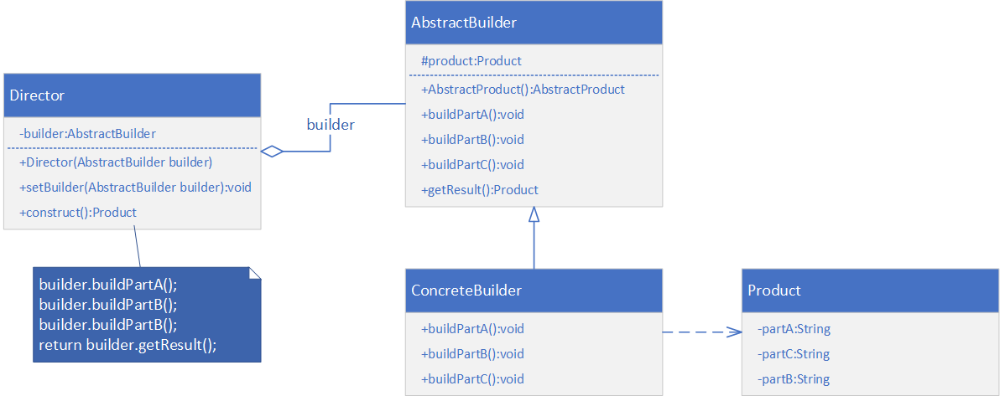

[toc]

# 建造者模式

建造者模式是最复杂的创建型模式，它将客户端与包含多个组成部分的复杂对象的创建过程分离，客户无需知道复杂对象的内部组成部分与装配方式，只需要知道建造者的类型即可。**它关注如何一步一步创建一个复杂对象**。

> 不同的具体建造者定义了不同的创建过程，且具体建造者相互独立，增加新的建造者非常方便，系统具有较好的扩展性。

**举个例子：**

当你在吃自助餐的时候，你需要选几个菜，这些菜之间没啥联系，但是最终组成的你的午餐，就相当于建造者最终产生的对象。

# 定义

将一个复杂对象的构建与它的表示分离，使得同样的构建过程可以创建不同的表示。建造者模式一步一步创建一个复杂的对象，它允许用户只通过指定复杂对象的类型和内容就可以创建他们。

# 建造者的结构

1. 抽象建造者（`Builder`）：为创建一个产品 `Product` 对象的各个部分指定抽象接口，在该接口中一般声明两类方法，一类方法是 `buildPartX()`，他们用来创建复杂对象的各个部件；另一类方法是`getResult()`，他们用来返回复杂对象。它既可以是抽象类，也可以是接口。
2. 具体建造者（`ConcreteBuilder`）：具体建造者实现了`Builder`接口，实现各个部件的构造和装配方法，定义并明确它所创建的复杂对象，也可以提供一个方法返回建造好的复杂产品对象。
3. 产品角色（`Product`）：产品角色是被构建的复杂对象，包含多个组成部件，具体建造者创建该产品的内部表示并定义它的装配过程。
4. 指挥者（`Director`）：负责安排复杂对象的建造次序，指挥者与抽象建造者之间存在关联关系，可以在其 `construct()`建造方法中调用建造者对象的部件构造与装配方法，完成复杂对象的建造。客户端一般只需要与指挥者进行交互，在客户端确定具体建造者的类型，并实例化具体建造者对象（也可以通过读取配置文件和反射机制），然后通过指挥者的构造函数或 `set`方法将该对象传入指挥者类中。

# 建造者模式-案例 1



# 建造者模式-案例 2

使用Java实现如下场景：

某游戏软件中人物角色包括多种类型，不同类型的人物角色，其性别、脸型、服装、发型等外部特征有所差异，使用建造者模式创建人物角色对象。

> 本人是个粗鄙之人，想到同款游戏貌似就是 LOL 了。那么这个例子就按照这个设定进行吧。

还有就是这个案例中的类图与上边案例1中差不多一致。就是使用的场景不同。喜欢的朋友可以去增加个反射进去动态生成具体的建造者对象。我这里就不供献类图了。咱们进入下一个环节！

# 建造者模式-案例 3

简化建造者模式的生成对象的过程！

其实就是一种特殊手段进行生成对象，而且该对象的属性全都不可改。

一般用在一次建造，多次使用，而且该对象的属性很多，但不一定全都得用的场景。

这个案例我直接把代码粘贴出来：

## Java 代码

```java
package org.feng.pattern.simple;

import lombok.Getter;

import java.time.LocalDate;
import java.util.Arrays;

/**
 * 简化建造对象的过程；
 * 这是一个用户类
 *
 * @author Feng
 * @date 2020/4/29 13:46
 */
@Getter
public class User {
    /**名字*/
    private final String name;
    /**爱好*/
    private final String[] hobbies;
    /**年龄*/
    private final Integer age;
    /**地址*/
    private final String address;
    /**生日*/
    private final LocalDate birthday;
    /**备注*/
    private final String info;

    private User(String name, String[] hobbies, Integer age, String address, LocalDate birthday, String info) {
        this.name = name;
        this.hobbies = hobbies;
        this.age = age;
        this.address = address;
        this.birthday = birthday;
        this.info = info;
    }

    @Override
    public String toString() {
        return "User{" +
                "name='" + name + '\'' +
                ", hobbies=" + Arrays.toString(hobbies) +
                ", age=" + age +
                ", address='" + address + '\'' +
                ", birthday=" + birthday +
                ", info='" + info + '\'' +
                '}';
    }

    /**
     * 用户建造者
     */
    public static class UserBuilder {
        /*
         * 在这里定义与User类相同的属性，注意不能用 final
         */
        /**名字*/
        private String name;
        /**爱好*/
        private String[] hobbies;
        /**年龄*/
        private Integer age;
        /**地址*/
        private String address;
        /**生日*/
        private LocalDate birthday;
        /**备注*/
        private String info;

        public UserBuilder setName(String name) {
            this.name = name;
            return this;
        }

        public UserBuilder setHobbies(String[] hobbies) {
            this.hobbies = hobbies;
            return this;
        }

        public UserBuilder setAge(Integer age) {
            this.age = age;
            return this;
        }

        public UserBuilder setAddress(String address) {
            this.address = address;
            return this;
        }

        public UserBuilder setBirthday(LocalDate birthday) {
            this.birthday = birthday;
            return this;
        }

        public UserBuilder setInfo(String info) {
            this.info = info;
            return this;
        }

        public User build(){
            return new User(name, hobbies, age, address, birthday, info);
        }
    }
}
```

**测试：**

```java
package org.feng.pattern.simple;

import java.time.LocalDate;

/**
 * 用户建造者的测试
 *
 * @author Feng
 * @date 2020/4/29 13:56
 */
public class Client {
    public static void main(String[] args) {
        User user = new User.UserBuilder()
                .setName("小冯")
                .setAge(25)
                .setAddress("北京")
                .setBirthday(LocalDate.of(2008, 10, 1))
                .setHobbies(new String[]{"唱","跳","Rap","篮球"})
                .setInfo("暂无")
                .build();

        // User{name='小冯', hobbies=[唱, 跳, Rap, 篮球], age=25, address='北京', birthday=2008-10-01, info='暂无'}
        System.out.println(user);
    }
}
```

# 总结

## 建造者模式的优点

1. 客户端不需要知道产品内部组成的细节，将产品本身与产品的创建过程解耦，使得相同的创建过程可以创建不同的产品对象。
2. 每一个具体的建造者都是单独的存在（相对独立），与其他的建造者无关。
3. 可以更加精细的控制产品的创建过程。将复杂产品的创建步骤分解在不同的方法中，使得创建过程更加清晰，也更方便使用程序来控制创建过程。
4. 增加新的具体建造者无需修改现有的代码。符合开闭原则。

## 建造者模式的缺点

1. 建造者模式所创建的产品一般都有较多的共同点，其组成部门相似。如果产品之间的差异性很大，则不适合使用建造者模式，因此其使用范围受到一定的限制。
2. 如果产品的内部变化复杂，可能会导致需要定义很多具体建造者类来实现这种变化，导致系统变的很庞大。

## 适用环境

1. 需要生成的产品对象有复杂的内部结构，这些产品对象通常包含多个成员属性。
2. 需要生成的产品对象的属性相互依赖，需要指定其生成顺序。
3. 对象的创建过程独立于创建该对象的类。在建造者模式中引入了指挥者类，将创建过程封装在指挥者类中，而不在创造者类中。
4. 隔离复杂对象的创建和使用，并使得相同的创建过程可以创建不同的产品。

## 建造者模式的扩展

### 1. 简化

+ 省略抽象建造者角色：当系统中只需要一个具体建造者的话，可以省略掉抽象建造者。

+ 省略指挥者角色：在具体建造者只有一个的情况下，如果抽象建造者角色已经被省略掉，那么还可以省略指挥者角色，让建造者角色扮演这个指挥者。

> 关于简化，本文中的第三个案例就是最好的实践了。

### 2. 建造者模式与抽象工厂模式的比较

与抽象工厂模式相比，建造者模式返回一个组装好的完整产品，而抽象工厂模式返回一系列相关的产品，这些产品位于不同的产品等级结构，构成了一个产品族。

在抽象工厂模式中，客户端实例化工厂类，然后调用工厂方法获取所需产品对象，而在建造者模式中，客户端不可以直接调用建造者的相关方法，而是通过指挥者类来指导如何生成对象，包括对象的组装过程和建造步骤，它侧重于一步步构造一个复杂对象，返回一个完整的对象。如果将抽象工厂模式看成汽车配件生产工厂，生产一个产品族的产品，那么建造者模式就是一个汽车组装工厂，通过对部件的组装可以返回一辆完整的汽车。