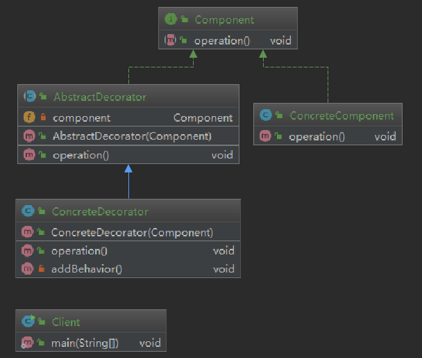
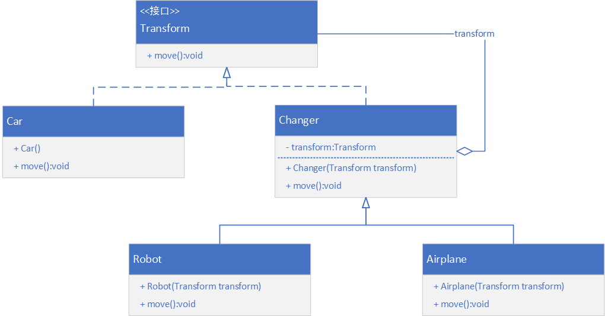
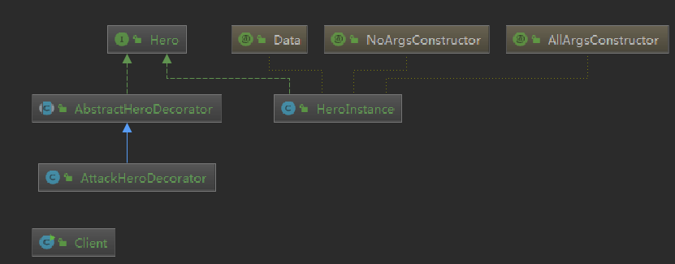
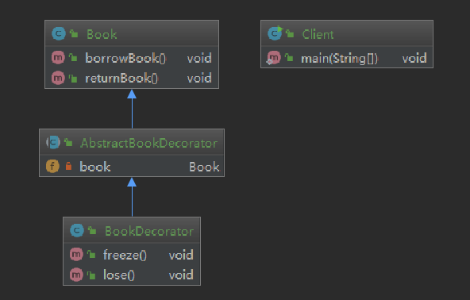

[toc]

# 装饰模式

装饰模式是一种用于替代继承的技术，它通过一种无须定义子类的方式给对象动态的增加职责，使用对象之间的关联关系取代类之间的继承关系。

> 什么是类之间的关联关系？请查看我的另一篇博客：[类图](https://blog.csdn.net/FBB360JAVA/article/details/80223898)中关于类之间关系的介绍！

在装饰模式中引入了装饰类，在装饰类中既可以调用被装饰类的方法，也可以定义新的方法，以便扩充类的功能。

装饰模式中降低了系统的耦合度，可以动态增加或删除对象的职责，并使得需要装饰的具体构件类和具体装饰类可以独立变化，增加新的具体构件类和具体装饰类都非常方便，符合“开闭原则”。

> 一个很形象的例子：
>
> 一张照片，经过装饰可以增加塑封、相框、花边等。这就是装饰模式的一个真实体现。

## 给类增加行为的两种方式

### 1. 继承

继承就不说了，子类拥有父类的方法以及自己可以定义新的方法，但是这是一种静态的，用户不能控制增加行为的方式和时机。

### 2. 关联

与继承相比较，更加灵活。一个类的对象嵌入另一个新对象中，由另一个对象来决定是否调用嵌入对象的行为来并扩展自己的行为，我们称新的对象为装饰器。

为了使得装饰器与它所装饰的对象对客户端来说透明，装饰器类和被装饰的类必须要实现相同的接口，客户端使用时无需关心一个类的对象是否被装饰过，可以一致性地使用未被装饰过的对象和装饰过的对象。

> 更多时候，我们会在被装饰的类中调用装饰器中的方法，实现更多的复杂功能。

## 模式定义

动态的给一个对象增加一些额外的职责，就增加对象的功能来说，装饰模式比生成子类实现更为灵活。其别名也可以称为包装器，与适配器模式的别名相同，但它们用于不同场合。

## 模式的结构



代码实现见：`org.feng.pattern.decorator` 包。

## 装饰模式之案例1

Java 实现如下场景：

变形金刚在变形之前是一辆汽车它可以在陆地上移动。当它变成机器人之后除了能够在陆地上移动之外，还可以说话；如果需要，它还可以变成飞机，除了在陆地上移动，还可以飞。



## 装饰模式之案例2

刚刚在写这个书上的案例1的时候，笔者突发奇想，有了自己的案例2：

> 在座的各位，有玩过游戏不，角色扮演的那种（王者荣耀、LOL啥的）。

咱们设计这样一个场景，目前你拿到的英雄是一个具体的类，我们来一起装饰它吧。比如，你玩LOL，选择了盖伦。那么出门装备，以及后期可能会 达到一个六神装的境界，这些都可以考虑为装饰品啊。有没有想通呢？



## 装饰模式之案例3

使用 Java 实现以下场景：

某图书馆管理系统中，书籍类（`Book`）具有借书方法 `borrowBook()`和还书方法 `returnBook()`。现需要动态给书籍对象添加冻结方法 `freeze()` 和遗失方法 `lose()` 。使用装饰模式设计该系统。



# 装饰模式的总结

## 优点

1. 装饰模式与继承关系的目的都是要扩展对象的功能，但是装饰模式可以**提供比继承更多的灵活性**。
2. 可以通过一种动态的方式来扩展一个对象的功能，通过配置文件可以在运行时选择不同的装饰器（这一点可以参考之前的那些文章以及案例），本质是**通过反射+特征名或类名来动态加载类并创建对象**的过程。
3. 通过使用不同的具体装饰类以及这些装饰类的排列组合，可以**创造出很多不同行为的组合**。可以使用多个具体装饰类来装饰同一个对象，得到功能更为强大的对象。
4. 具体构件类与具体装饰类可以独立变化，用户可以根据需要增加新的具体构件类和具体装饰类，在使用时在对其进行组合原有代码无须改变，符合**开闭原则**。

## 缺点

1. 使用装饰模式进行系统设计时将产生很多小的对象，这些对象的区别在于它们之间相互连接的方式有所不同，而不是它们的类或属性值有所不同，同时还会产生很多具体的装饰类。这些装饰类和小对象的产生增加了系统的复杂度，增加了学习和使用的难度。
2. 这种比继承更加灵活的特性，也同时意味着装饰模式比继承更加易于出错，排错也很困难，对于多次装饰的对象，测试时寻找错误可能需要逐级排查，比较繁琐。

## 适用环境

1. 在不影响其他对象的情况下，以动态、透明的方式给单个对象添加职责。

2. 需要动态地给一个对象增加功能，这些功能也可以动态撤销。

3. 当不能采用继承的方式对系统进行扩充或者采用继承不利于系统扩展和维护时。

   > 不能采用继承的情况大概有：
   >
   > + 系统中存在大量独立的扩展，为支持每一种组合将产生大量的子类。
   > + 类定义时不能有子类，比如使用了 final 定义类。


## Java中的应用

`InputStream` 和 `OutputStream` 的实现类。

比如 `FilterInputStream`中有这样一段代码：

```java
public class FilterInputStream extends InputStream {
    /**
     * The input stream to be filtered.
     */
    protected volatile InputStream in;

    /**
     * Creates a <code>FilterInputStream</code>
     * by assigning the  argument <code>in</code>
     * to the field <code>this.in</code> so as
     * to remember it for later use.
     *
     * @param   in   the underlying input stream, or <code>null</code> if
     *          this instance is to be created without an underlying stream.
     */
    protected FilterInputStream(InputStream in) {
        this.in = in;
    }
    ...
}
```

## 模式扩展

> 对装饰模式进行简化：去掉抽象构件，将其中的内容写到具体构件中，然后抽象装饰器继承具体构件并组合对象即可。最终可以使用具体装饰器实现不同的功能。

对装饰模式进行简化时，需要注意到：

1. 一个装饰类的接口必须与被装饰类的接口保持一致。对于客户端来说，无论是装饰之前的对象还是装饰之后的对象都可以同等对待。
2. 尽量保持具体构件类作为一个职责单一的类。不把过多的逻辑和状态放进去。
3. 如果只有一个具体装饰类而没有抽象装饰类，那么抽象装饰类可以作为具体构件类的直接子类。（简化）

## 透明模式和半透明模式

### 透明模式

要求严格按照抽象（面向抽象编程）。

要求客户端程序不应该声明具体构件类和具体装饰类型，应该全部声明为抽象构件类。

> 一般透明模式用的不多。

### 半透明模式

装饰模式的用意不在改变接口的前提下，增强原有类的功能。在增强功能时用户往往需要创建新的方法。

比如：在变形金刚的案例中，机器人 `Robot` 类增加的 `say()` 的方法。