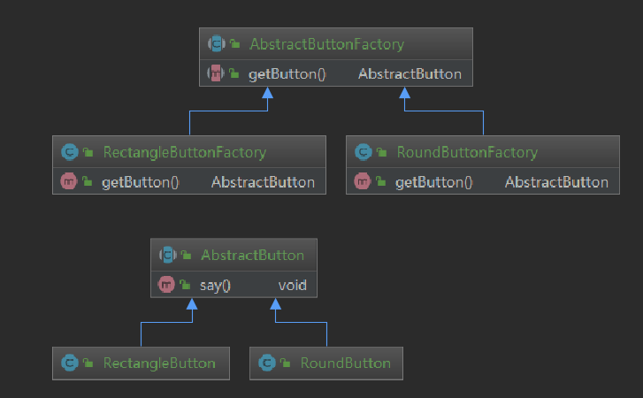

[toc]

# 工厂方法模式

工厂方法模式是简单工厂模式的延伸，它继承了简单工厂模式的优点，同时还弥补了简单工厂模式的缺陷，更好地符合“开闭原则”。

增加新的具体产品对象不需要对已有系统做任何修改。工厂方法模式引入了抽象的工厂类，而将具体产品的创建过程封装在抽象工厂类的子类，也就是具体的工厂类中。

工厂方法模式是GOF中的一种。

> 还记得在简单工厂模式中的那个按钮的案例吗？
>
> 在那个按钮的案例中，如果要新增加一种按钮，则需要修改工厂类。如果在工厂方法中，就不需要了。只需要增加一个新的具体的工厂类就行了。

## 工厂方法模式的目的和定义

**定义：工厂方法模式又叫工厂模式，属于创建型模式。工厂父类负责定义创建产品对象的公共接口，而工厂子类则负责生成生成具体的产品对象，这样做的目的是将产品类的实例化操作延迟到工厂子类中完成。**

换句话说，就是通过工厂子类来确定究竟应该实例化哪一个具体产品类。

# 工厂方法模式-案例 1

使用Java实现如下场景：

改写简单工厂中的按钮的例子，将其修改为工厂方法模式。

# 工厂方法模式-案例 2

使用Java 实现如下场景：

某系统日志记录器要求支持多种日志记录方式，比如文件记录、数据库记录。且可以动态选择日志记录的方式。

这个类图，我还是亲手画次吧。

# 总结

## 工厂方法模式的优点

1. 向使用者隐藏具体产品类的实现细节，使用者只需知道所需产品对应的工厂，甚至不用知道具体产品类的类名。
2. 可以自主决定使用哪一种具体的产品对象。与静态工厂方法相比，灵活性更高了。
3. 扩展性好，符合开闭原则。

## 工厂方法模式的缺点

1. 类会变得更多（与静态工厂方法相比）。
2. 加入了抽象层，以及 DOM解析等，提高了系统的实现难度。

## 适用环境

1. 一个类不知道它所需要的对象的类。（只要得到工厂即可）

2. 一个类通过其子类来指定创建哪个对象。
3. 将创建对象的任务委托给多个工厂子类中的某一个。（需要动态指定时，可以将具体的类名存储在数据库或属性文件、配置文件中）

# 工厂方法模式在Java中的应用

1. `Collection.iterator() `方法就是一个很好的案例。其子接口List中实现了该方法，返回某个对象。这一点很符合适用环境中的第二条。

2. `JDBC` 中的`Connection.createStatement()`方法和 `Statement.executeQuery()`也是工厂方法模式。

3. Spring 框架中的 `BeanFactory.getBean()`。

# 工厂方法的扩展

1. **在抽象工厂中可以定义多个工厂方法，让不同的具体工厂角色实现不同的工厂方法**。以减少类的数量。这一点，在 Java 8 中使用接口的默认方法可以很好的应用起来。在顶层工厂接口中定义多个默认的方法，实现内容是`throw new UnsupportedOperationException()`，而后需要其实现类去实现（重写）这个默认方法即可。
2. **对象的重复使用。**创建对象很耗费资源，当首次创建之后，将对象保存起来（比如保存到Map中），下次需要使用时，直接从Map中获取即可。

3. 当具体的工厂很少，只有1个时，可以改写为简单工厂模式，以降低系统的复杂性。

