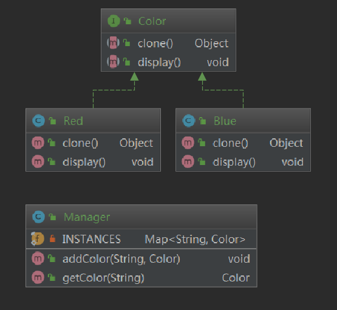

# 原型模式

原型模式也属于建造型模式，当**需要创建大量相同或相似的对象时**，可以通过对一个已有对象的复制获取更多对象。

> Java 中可以使用克隆实现。克隆又分为深克隆和浅克隆。

在软件系统中，有些对象的创建过程较为复杂，而且有时候需要频繁创建，原型模式通过给出一个原型对象来指明所要创建的对象的类型，然后用复制这个原型对象的方法创建出更多同类型的对象，这就是原型模式的意图所在。

# 定义

用原型实例指定创建对象的种类，并且通过复制这些原型创建新的对象。原型模式允许一个对象再创建另一个可定制的对象，无须知道任何的创建细节。

原型模式的基本工作原理是通过将一个原型对象传给那个要发动创建的对象，这个要发动创建的对象通过请求原型对象赋值原型来实现创建过程。

# 原型模式的结构

1. 抽象原型类：定义具有克隆自己的方法的接口。是所有具体原型类的公共父类，可以是抽象类也可以是接口。
2. 具体原型类：实现具体的克隆方法，在克隆方法中返回自己的一个克隆对象。
3. 客户端类：让一个原型克隆自身，从而创建一个新的对象，在客户类中只需要直接实例化或通过工厂方法等方式创建一个对象，在通过调用该对象的克隆方法复制得到多个相同的对象。

# Java中的克隆

在`Object`类中有定义一个 `clone()`方法，可以将一个对象复制一份。

实现克隆时，需要实现 `Cloneable`接口，表示这个类支持克隆。否则会抛出 `CloneNotSupportException`。

## 实现

1. 对任何的对象 `x`，都有 `x.clone() != x`，即克隆对象与原对象不是同一个。
2. 对任何的对象 `x`，都有`x.clone().getClass() == x.getClass()`，即克隆对象与原对象的类型一样。
3. 如果对象`x`的 `equals()`方法定义的恰当，那么 `x.clone().euqals(x)` 应该成立。

## 步骤

1. 在派生类中覆盖基类的 `clone()`方法，并声明为 public 。
2. 在派生类的 `clone()` 方法中，调用`super.clone()`。
3. 在派生类中实现 `Cloneable` 接口。

## Java 代码

```java
package org.feng.pattern.clone;

import java.util.Objects;

/**
 * 定义要克隆的那个类，实现 Cloneable 接口
 *
 * @author Feng
 * @date 2020/5/3 13:21
 * @see Cloneable
 */
public class PrototypeDemo implements Cloneable {
    private String name;
    @Override
    protected Object clone() throws CloneNotSupportedException {
        return super.clone();
    }

    @Override
    public boolean equals(Object o) {
        if (this == o) {
            return true;
        }
        if (o == null || getClass() != o.getClass()) {
            return false;
        }
        PrototypeDemo demo = (PrototypeDemo) o;
        return Objects.equals(name, demo.name);
    }

    @Override
    public int hashCode() {
        return Objects.hash(name);
    }

    public String getName() {
        return name;
    }

    public void setName(String name) {
        this.name = name;
    }
}
```

## 测试

```java
package org.feng.pattern.clone;

/**
 * 克隆模式的测试
 *
 * @author Feng
 * @date 2020/5/3 13:23
 */
public class Client {
    public static void main(String[] args) throws CloneNotSupportedException {
        PrototypeDemo demo = new PrototypeDemo();
        Object clone = demo.clone();

        // false
        System.out.println(demo == clone);
        // true
        System.out.println(demo.equals(clone));
        // true
        System.out.println(demo.getName() == ((PrototypeDemo)clone).getName());
    }
}
```

# 深克隆和浅克隆

## 浅克隆

在浅克隆中，被复制对象的所有普通成员变量都具有与原来的对象相同的值，而所有的其他对象的引用仍然指向原来的对象。

> 换言之，浅克隆仅仅复制所考虑的对象，而不复制它所引用的成员对象，也就是**其中的成员对象并不复制**。

## 深克隆

在深克隆中被复制对象的所有普通成员变量也都含有与原来的对象相同的值，除去那些引用其他对象的变量。那些引用其他对象的变量将指向被复制过的新对象，而不再是原有的那些被引用的对象。

> 换言之，深克隆把要赋值的对象所引用的对象都复制了一遍，在深克隆中，除了对象本身被复制以外，**对象包含的引用也被复制**。

在 Java 中实现深克隆时，需要通过序列化等方式实现：

在Java语言中，序列化就是将对象写到流的过程，写到流中的对象是原有对象的一个拷贝，而原对象仍然存在内存中。**通过序列化实现的拷贝不仅可以复制对象本身，而且可以复制其引用的成员对象**，因此通过序列化将对象写到一个流中，再从流中将其读出，从而实现克隆。

> 需要注意的是，目标对象需要实现 `Serialiazble` 接口，否则无法实现序列化。

# 原型模式之浅克隆-案例 1

即上述中的Java代码。

需要注意的结果是：

在使用 equals方法时，进行比较两个对象，重写了其 equals方法后，其逻辑是比较俩字符串的内容，因此是 true。但是俩对象直接 == 进行比较时，因为是浅克隆，因此结果是 false。

在最后还验证了属性的地址，是一样的，这就证明了浅克隆只是将引用指向了原来对象的属性引用。

# 原型模式之深克隆-案例 1

将上述代码修改为深克隆即可：

## Java 代码

```java
package org.feng.pattern.deep;

import java.io.*;
import java.util.Objects;

/**
 * 深克隆的实现：使用序列化
 *
 * @author Feng
 * @date 2020/5/3 13:56
 */
public class DeepPrototypeDemo implements Serializable {
    private static final long serialVersionUID = -7788867131779264434L;
    private String name;

    public DeepPrototypeDemo(String name) {
        this.name = name;
    }

    public String getName() {
        return name;
    }

    public void setName(String name) {
        this.name = name;
    }

    @Override
    public boolean equals(Object o) {
        if (this == o) {
            return true;
        }
        if (o == null || getClass() != o.getClass()) {
            return false;
        }
        DeepPrototypeDemo that = (DeepPrototypeDemo) o;
        return Objects.equals(name, that.name);
    }

    @Override
    public int hashCode() {
        return Objects.hash(name);
    }

    /**
     * 深度克隆
     * @return 克隆的结果
     */
    public DeepPrototypeDemo deepClone() throws IOException, ClassNotFoundException {
        // 将对象写入流中
        ByteArrayOutputStream bao = new ByteArrayOutputStream();
        ObjectOutputStream oos = new ObjectOutputStream(bao);
        oos.writeObject(this);

        // 将对象从流中读出
        ByteArrayInputStream bai = new ByteArrayInputStream(bao.toByteArray());
        ObjectInputStream ois = new ObjectInputStream(bai);
        return (DeepPrototypeDemo) ois.readObject();
    }
}
```

## 测试

```java
package org.feng.pattern.deep;

import java.io.IOException;

/**
 * 深克隆的测试
 *
 * @author Feng
 * @date 2020/5/3 14:02
 */
public class Client {
    public static void main(String[] args) throws IOException, ClassNotFoundException {
        DeepPrototypeDemo deepPrototypeDemo = new DeepPrototypeDemo("Feng");
        DeepPrototypeDemo deepPrototypeDemo1 = deepPrototypeDemo.deepClone();

        // true
        System.out.println(deepPrototypeDemo.equals(deepPrototypeDemo1));
        // false
        System.out.println((deepPrototypeDemo.getName() == deepPrototypeDemo1.getName()));
        // true
        System.out.println(deepPrototypeDemo.getName().equals(deepPrototypeDemo1.getName()));
    }
}
```

# 原型模式的总结

## 优点

1. 当创建新的对象实例较为复杂时，使用原型模式可以**简化对象的创建过程**，通过一个已有实例可以提高实例的创建效率。
2. 可以动态增加或减少产品类。由于创建产品类实例的方法是产品类（具体原型类）内部具有的，因此增加新产品对整个结构没有影响，在原型模式中提供了抽象原型类，在客户端可以针对抽象原型类进行编程，而将具体原型类写入配置文件中，增加或减少产品类对原有系统都没有任何影响。
3. 原型模式提供了简化的创建结构。工厂方法模式常常需要有一个与产品类等级结构相同的等级结构，而原型模式就不需要这样，原型模式中产品的复制是通过封装在原型类中的 `clone()` 方法实现的，无须专门的工厂类来创建产品。
4. 可以使用深克隆的方式保存对象的状态。使用原型模式将对象复制一份并将其状态保存起来，以便在需要的时候使用（如恢复到某一历时状态）。

## 缺点

1. 需要为每一个类配备一个克隆方法，而且这个克隆方法需要对类的功能进行通盘考虑，这对全新的类来说不是很难，但对已有的类进行改造时，不一定是件容易的事，必须修改其源代码，**违背了“开闭原则”**。
2. 在实现深克隆时需要编写较为复杂的代码。

# 模式适用环境

1. 创建新对象成本较大（如初始化需要占用较长的时间，占用太多的CPU资源或网络资源），新的对象可以通过原型模式对已有对象进行复制来获得，如果是相似对象，则可以对其属性稍作修改。
2. 如果系统要保存对象的状态（比如，VM中的虚拟机可以进行拍快照），而对象的状态变换很小，或者对象本身占内存不大的时候，也可以使用原型模式配合**备忘录模式（这个后期介绍）**来应用。相反，如果对象的状态变化较大或很大，对象的占用内存很大等情况，使用**状态设计模式（这个后期介绍）**能更好点。
3. 需要避免使用分层次的工厂类来创建分层次的对象。并且类的实例对象只有一个或几个组合状态通过复制原型对象得到新实例可能比使用构造函数创建一个实例更方便。

# 原型模式之浅克隆-案例 2

对原型模式的一个扩展。

见包：`org.feng.pattern.extend`



# 原型模式之相似对象-案例

创建多个对象，其中多个属性相同，使用原型模式克隆之后，只需要修改个别属性即可。

这里使用的案例是学生对象，克隆之后，只要修改学生姓名、年龄属性即可。其学校、专业等属性不变。符合该场景。

代码案例在：`org.feng.pattern.similar` 包中。


