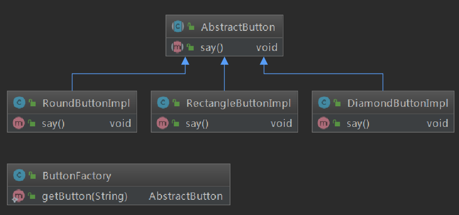
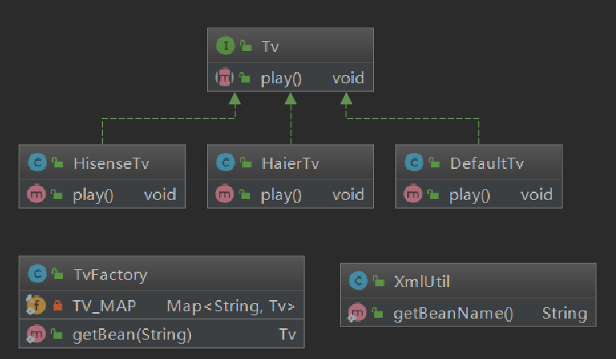
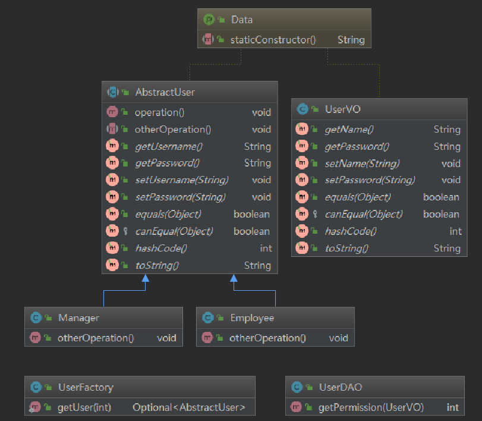

[toc]

# 简单工厂模式

> 简单工厂模式不属于 GOF 23 种设计模式。
>
> 它是最简单的设计模式之一，也是使用比较频繁的一个模式，同时属于创建型模式，它可以作为创建型模式的敲门砖。

## 创建型模式

所谓创建型模式就是将对象的创建和使用分离开来。外界只需要使用即可，不需要知道该对象具体是如何创建的。

## 创建型模式的举例

**1、开车的例子**

假如你是一个程序员，工作1年多攒了10+万人民币，买了个轿车。这个轿车，是不是不用管它是怎么造出来的？只管开车就对了！（你肯定没有我开车的证据）。

权且先把创建轿车的厂子叫做工厂（因为本节内容是简单工厂的啦）。

**2、水果的例子**

我家是卖猕猴桃的，家里有种。那么请问吃猕猴桃的那些客户们需要知道这猕猴桃具体是咱生产出来的？是树上结的果子还是灌木类的植物的果实？完全不需要的好嘛！

只管吃就对了。当然，你不能不买啊。

权且先把种猕猴桃的我家叫工厂（因为本节内容是简单工厂的啦）。

## 简单工厂模式的目的与定义

**目的：实际开发中，有时会需要创建一些来自相同父类的的类的实例，一般这种场景下，我们可以通过传入不同的参数来获取不同的实例对象。**

> 在使用Java语言实现时，习惯上将创建其他实例的方法定义为 static 方法，外部不需要实例化这个类就能够通过类名去调用，这种方法也叫静态工厂方法。

**定义：简单工厂模式又叫做静态工厂方法模式。在简单工厂模式中，可以根据参数的不同返回不同类的实例。简单工厂专门定义一个类负责创建其他类的实例，被创建的实例通常都具有共同的父类。**

# 简单工厂模式-案例 1

使用Java实现如下场景：

一个工厂可以提供多个多个外观不同的按钮（圆形、矩形、菱形等）。

项目地址：

# 简单工厂模式-案例 2

使用Java实现如下场景：

一个电视工厂，通过传入的参数（从`xml`文件读取），获得不同的电视实例。

项目地址：

# 简单工厂模式-案例 3

使用Java 实现如下场景：

权限控制，通过传入的`UserVO`对象，获取权限值，通过权限值在工厂中获取对象。

项目地址：

# 总结

## 优点

1. 拥有必要的判断逻辑，客户可以免除创建实例的职责。

2. 客户端不用知道具体类的类名，只需要必须的参数即可。
3. 通过引入配置文件，可以在不修改客户端代码的情况更换、新增具体的实例。一定程度上增加了系统的灵活性。

## 缺点

1. 工厂类成为核心，一旦工厂类不能正常工作，一切都将完蛋。
2. 系统中的类的数量会增加很多，导致可读性会变差。
3. 简单工厂由于使用了静态方法，其子类是无法继承的。（这一点有些面试题会考哦，简单来说就是，子父类中都定义了同样的静态方法，当声明父类，实例化子类的时候，最终使用对象引用调用该静态方法，会直接调用父类的静态方法。）

4. 系统扩展困难，因为逻辑判断多啊。

## 适用环境

工厂类负责创建的对象数目较少。客户端只关注需要的参数，不关注实现细节。

有的时候，我们还会把抽象父类同时作为工厂类，就是说减少了类的数目。